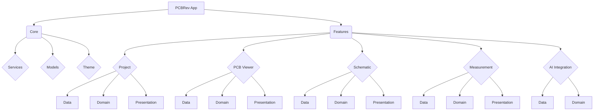

# PCBRev: Asystent Inżynierii Odwrotnej PCB

## 1. Założenia Projektu

PCBRev to aplikacja Flutter, której celem jest wspieranie inżynierii odwrotnej urządzeń elektronicznych. Umożliwia ona użytkownikom tworzenie schematów urządzeń na podstawie pomiarów fizycznych i analizy wizualnej płytek PCB, z wykorzystaniem wsparcia sztucznej inteligencji.

### 1.1. Podstawowa Funkcjonalność

Aplikacja ma za zadanie ułatwić proces rekonstrukcji schematu urządzenia elektronicznego poprzez:
- **Pomiary komponentów i połączeń:** Rejestrowanie wartości komponentów (np. rezystancji, pojemności) oraz śledzenie połączeń między nimi za pomocą omomierza lub innych narzędzi pomiarowych.
- **Analiza wizualna PCB:** Przetwarzanie zdjęć płytek PCB (zarówno strony komponentów, jak i strony połączeń) w celu dopasowania ich i wnioskowania o połączeniach między komponentami/wyprowadzeniami. Kluczowym elementem jest możliwość odwrócenia poziomego strony połączeń (dolnej) i nałożenia jej na stronę komponentów (górnej), co pozwala na wizualizację połączeń między warstwami płytki.
- **Wsparcie AI:** Wykorzystanie sztucznej inteligencji (za pośrednictwem `mcp-server`) do interpretacji połączeń, identyfikacji komponentów i analizy architektury urządzenia. AI otrzymuje bazę danych z aktualnymi danymi urządzenia, jego połączeniami, architekturą i obrazami, a następnie aktualizuje tę bazę.


### 1.2. Platforma Docelowa

Aplikacja jest rozwijana w technologii Flutter, co umożliwia jej działanie na wielu platformach, w tym na **Androidzie**, co jest głównym celem projektu. Architektura została zaprojektowana z myślą o skalowalności i łatwej adaptacji do różnych środowisk.

### 1.3. Kluczowe Funkcje

- **Zarządzanie obrazami PCB:** Wczytywanie i wyświetlanie zdjęć PCB (strona komponentów, strona połączeń).
- **Narzędzia do edycji obrazu:** Obracanie, odwracanie (poziome/pionowe - kluczowe dla nałożenia strony połączeń na stronę komponentów), regulacja kontrastu, jasności i inwersja kolorów dla lepszej analizy wizualnej.
- **Rejestrowanie pomiarów:** Moduł do wprowadzania i zarządzania pomiarami rezystancji, napięcia i ciągłości.
- **Modelowanie schematu:** Tworzenie i aktualizowanie cyfrowego modelu PCB, zawierającego komponenty, piny i połączenia (netlistę).
- **Integracja z AI (MCP Server):** Dwukierunkowa komunikacja z zewnętrznym serwerem AI, wysyłając dane PCB i obrazy do analizy oraz odbierając wyniki.
- **Zapis/Odczyt Projektu:** Możliwość zapisywania i wczytywania stanu projektu (w tym obrazów i ich modyfikacji) do/z pliku.

## 2. Architektura Aplikacji

### 2.1. Przegląd

Architektura PCBRev opiera się na podejściu modułowym, zorientowanym na funkcje, co zapewnia wysoką spójność i niskie sprzężenie między komponentami. Główne elementy architektury to:

- **Core (`lib/core/`)**: Zawiera współdzielony kod, narzędzia i podstawowe klasy używane w całej aplikacji.
- **Features (`lib/features/`)**: Główny katalog zawierający moduły funkcjonalne. Każdy moduł jest samodzielną jednostką z własną architekturą wewnętrzną (dane, domena, prezentacja).

### 2.2. Struktura Modułów Funkcjonalnych

Każdy moduł w katalogu `lib/features/` jest zorganizowany według następującego schematu:

- **Data**: Warstwa danych, odpowiedzialna za źródła danych (np. usługi, bazy danych) i modele.
- **Domain**: Warstwa domeny, zawierająca logikę biznesową i przypadki użycia.
- **Presentation**: Warstwa prezentacji, odpowiedzialna za interfejs użytkownika (widgety, strony) i zarządzanie stanem.

### 2.3. Diagram Architektury



## 3. Koncepcja Pracy i Model Danych (Workflow)

Aplikacja PCBRev jest zaprojektowana wokół interaktywnego procesu tworzenia schematu, inspirowanego standardami oprogramowania CAD, takiego jak KiCad. Poniżej opisano kluczowe koncepcje przepływu pracy oraz model danych, który leży u podstaw aplikacji.

### 3.1. Interfejs Użytkownika

Główny interfejs aplikacji jest podzielony na trzy panele, aby zapewnić efektywną organizację pracy:
- **Panel Lewy (Listy Globalne):** Zawiera listę wszystkich zidentyfikowanych komponentów oraz sieci (połączeń) w projekcie. Listy te są globalne dla całego projektu i pogrupowane według typów (np. rezystory, kondensatory).
- **Panel Centralny (Widok Roboczy):** Jest to główny obszar roboczy, który może działać w dwóch trybach:
    - **Widok Obrazu:** Wyświetla załadowane zdjęcia PCB, umożliwiając ich analizę i nakładanie adnotacji.
    - **Widok Schematu:** Działa jak edytor schematów, na którym użytkownik może umieszczać symbole komponentów i rysować połączenia.
- **Panel Prawy (Właściwości i Pomiary):** Służy do wyświetlania szczegółów zaznaczonego elementu oraz do zarządzania operacjami ogólnymi, takimi jak wprowadzanie wyników pomiarów.

### 3.2. Proces Tworzenia Schematu

Proces rekonstrukcji schematu jest iteracyjny i opiera się na poniższych krokach:

1.  **Dodawanie Obrazów:** Użytkownik rozpoczyna od załadowania zdjęć płytki PCB.
2.  **Identyfikacja Komponentów:** Na podstawie analizy wizualnej i pomiarów, użytkownik dodaje komponenty do globalnej listy w lewym panelu.
3.  **Tworzenie Schematu:** Użytkownik przełącza się na widok schematu. Komponenty z globalnej listy można przeciągać na obszar roboczy jako symbole. Każdy symbol posiada punkty połączeń (piny), które przyciągane są do siatki, co ułatwia precyzyjne rysowanie.
4.  **Definiowanie Połączeń (Netów):** Użytkownik rysuje połączenia (linie - *wires*) pomiędzy pinami komponentów lub innymi połączeniami. Każde narysowane połączenie tworzy lub aktualizuje logiczną sieć (*Net*) w globalnej netliście projektu.

### 3.3. Model Danych Inspirowany KiCad

Kluczowym elementem architektury jest rozdzielenie **modelu logicznego** od jego **reprezentacji wizualnej**.

-   **Model Logiczny (Globalny):**
    -   **Net (Sieć):** Reprezentuje logiczne połączenie między co najmniej dwoma punktami (pinami komponentów). Jest to abstrakcyjny zbiór węzłów, podobnie jak w netliście KiCad. Przykładowo, sieć `VCC` łączy wszystkie piny, które mają być podłączone do zasilania.
        ```
        (net (code 1) (name "VCC")
          (node (ref V1) (pin 1))
          (node (ref R1) (pin 1))
          (node (ref U1) (pin 1)))
        ```
    -   **Component (Komponent):** Globalna definicja komponentu, zawierająca jego ID, typ, wartość i listę pinów.

-   **Reprezentacja Wizualna (Lokalna dla Widoku):**
    -   Każdy widok (czy to schemat, czy obraz PCB) posiada własną listę elementów wizualnych, które odnoszą się do modelu logicznego. Oznacza to, że **każdy obraz ma własną listę komponentów** (będących referencjami do listy globalnej), gdzie każdy komponent ma określone, lokalne współrzędne dla swoich punktów połączeń (pinów). Podobnie, **każdy obraz posiada własną listę wizualnych reprezentacji sieci**, które odnoszą się do globalnej netlisty, ale posiadają niezależne współrzędne dla węzłów i przewodów, tworząc jedynie wizualny kształt połączenia na danym obrazie.
    -   **Symbol:** Wizualna reprezentacja komponentu na schemacie, posiadająca współrzędne (`at`), referencję (`ref`) i inne atrybuty graficzne.
    -   **Wire (Przewód):** Linia graficzna łącząca punkty na schemacie. Posiada współrzędne (`pts`) definiujące jej kształt.
    -   **Junction (Węzeł):** Punkt graficzny wskazujący na połączenie kilku przewodów.
        ```
        (symbol (lib_id "Power:VCC") (at 100 50 0) (ref "V1") ...)
        (wire (pts (xy 100 50) (xy 120 50)))
        (junction (at 120 50))
        ```
    - Taki podział pozwala na elastyczność: ta sama logiczna sieć `VCC` może być inaczej narysowana na schemacie, a inaczej reprezentowana jako adnotacja na zdjęciu PCB. Użytkownik może dodawać komponenty i sieci z globalnej listy do dowolnego widoku, a ich pozycja i wygląd będą zapisane lokalnie dla tego widoku, nie wpływając na inne.

## 4. Szczegóły Implementacji (Aktualny Stan)

Projekt jest w fazie aktywnego rozwoju, a poniżej przedstawiono kluczowe aspekty obecnej implementacji.

### 4.1. Struktura Projektu

```
pcb_rev/
├── lib/
│   ├── core/
│   │   ├── models/
│   │   ├── services/
│   │   └── theme/
│   ├── features/
│   │   ├── ai_integration/
│   │   │   ├── data/
│   │   │   └── domain/
│   │   ├── measurement/
│   │   │   ├── data/
│   │   │   ├── domain/
│   │   │   └── presentation/
│   │   ├── pcb_viewer/
│   │   │   ├── data/
│   │   │   ├── domain/
│   │   │   └── presentation/
│   │   ├── project/
│   │   │   ├── data/
│   │   │   ├── domain/
│   │   │   └── presentation/
│   │   └── schematic/
│   │       ├── data/
│   │       ├── domain/
│   │       └── presentation/
│   └── main.dart
├── pubspec.yaml
├── README.md
... (pozostałe pliki projektu Flutter)
```

### 4.5. Zależności

Projekt wykorzystuje następujące kluczowe zależności (zdefiniowane w `pubspec.yaml`):
- `flutter`: Podstawowy framework UI.
- `http`: Do komunikacji HTTP (np. z MCP Server).
- `image`: Biblioteka do przetwarzania obrazów.
- `desktop_drop`: Do obsługi przeciągania i upuszczania plików na platformach desktopowych.
- `file_picker`: Do wyboru i zapisu plików przez użytkownika.

## 5. Jak Uruchomić

Aby uruchomić aplikację, wykonaj następujące polecenia w katalogu głównym projektu (`pcb_rev`):

```bash
cd pcb_rev
flutter run -d linux # lub inne dostępne urządzenie, np. chrome, windows, macos
```

## 6. Dalszy Rozwój

- **Rozbudowa analizy AI:** Implementacja rzeczywistej logiki analizy w `mcp_server` i integracja z modelem AI do inkrementalnej budowy schematu na podstawie analizy połączeń między komponentami.
- **Wyrównywanie i nałożenie obrazów:** Rozwinięcie funkcji `alignImages` w `ImageProcessor` do precyzyjnego dopasowywania obrazów, w tym odwrócenia poziomego strony połączeń (dolnej) i nałożenia jej na stronę komponentów (górnej) w celu wizualizacji połączeń między warstwami płytki.
- **Interaktywne adnotacje:** Umożliwienie użytkownikowi dodawania, edytowania i usuwania adnotacji bezpośrednio na obrazie PCB.
- **Generowanie netlisty:** Rozbudowa funkcji eksportu do standardowych formatów netlist (np. SPICE, KiCad).
- **Walidacja schematu:** Implementacja narzędzi do automatycznej weryfikacji poprawności rekonstruowanego schematu.
- **Wsparcie dla wielu warstw PCB:** Rozszerzenie modelu danych i UI o obsługę wielowarstwowych płytek.
