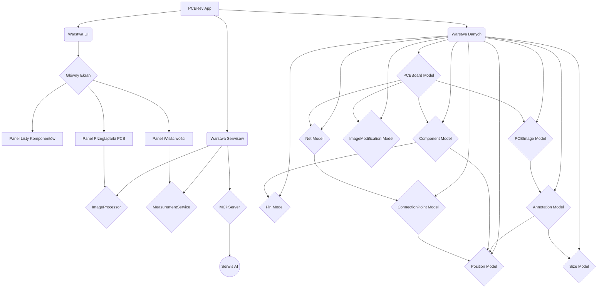

# PCBRev: Asystent Inżynierii Odwrotnej PCB

## 1. Założenia Projektu

PCBRev to aplikacja Flutter, której celem jest wspieranie inżynierii odwrotnej urządzeń elektronicznych. Umożliwia ona użytkownikom tworzenie schematów urządzeń na podstawie pomiarów fizycznych i analizy wizualnej płytek PCB, z wykorzystaniem wsparcia sztucznej inteligencji.

### 1.1. Podstawowa Funkcjonalność

Aplikacja ma za zadanie ułatwić proces rekonstrukcji schematu urządzenia elektronicznego poprzez:
- **Pomiary komponentów i połączeń:** Rejestrowanie wartości komponentów (np. rezystancji, pojemności) oraz śledzenie połączeń między nimi za pomocą omomierza lub innych narzędzi pomiarowych.
- **Analiza wizualna PCB:** Przetwarzanie zdjęć płytek PCB (zarówno strony komponentów, jak i strony połączeń) w celu dopasowania ich i wnioskowania o połączeniach między komponentami/wyprowadzeniami. Kluczowym elementem jest możliwość odwrócenia poziomego strony połączeń (dolnej) i nałożenia jej na stronę komponentów (górnej), co pozwala na wizualizację połączeń między warstwami płytki.
- **Wsparcie AI:** Wykorzystanie sztucznej inteligencji (za pośrednictwem `mcp-server`) do interpretacji połączeń, identyfikacji komponentów i analizy architektury urządzenia. AI otrzymuje bazę danych z aktualnymi danymi urządzenia, jego połączeniami, architekturą i obrazami, a następnie aktualizuje tę bazę.


### 1.2. Platforma Docelowa

Aplikacja jest rozwijana w technologii Flutter, co umożliwia jej działanie na wielu platformach, w tym na **Androidzie**, co jest głównym celem projektu. Architektura została zaprojektowana z myślą o skalowalności i łatwej adaptacji do różnych środowisk.

### 1.3. Kluczowe Funkcje

- **Zarządzanie obrazami PCB:** Wczytywanie i wyświetlanie zdjęć PCB (strona komponentów, strona połączeń).
- **Narzędzia do edycji obrazu:** Obracanie, odwracanie (poziome/pionowe - kluczowe dla nałożenia strony połączeń na stronę komponentów), regulacja kontrastu, jasności i inwersja kolorów dla lepszej analizy wizualnej.
- **Rejestrowanie pomiarów:** Moduł do wprowadzania i zarządzania pomiarami rezystancji, napięcia i ciągłości.
- **Modelowanie schematu:** Tworzenie i aktualizowanie cyfrowego modelu PCB, zawierającego komponenty, piny i połączenia (netlistę).
- **Integracja z AI (MCP Server):** Dwukierunkowa komunikacja z zewnętrznym serwerem AI, wysyłając dane PCB i obrazy do analizy oraz odbierając wyniki.
- **Zapis/Odczyt Projektu:** Możliwość zapisywania i wczytywania stanu projektu (w tym obrazów i ich modyfikacji) do/z pliku.

## 2. Architektura Aplikacji

### 2.1. Przegląd

Architektura PCBRev opiera się na warstwowym podejściu, co zapewnia modularność, łatwość testowania i rozszerzalność. Główne warstwy to:
- **Warstwa UI (User Interface):** Odpowiedzialna za prezentację danych i interakcję z użytkownikiem.
- **Warstwa Serwisów (Services):** Zawiera logikę biznesową i komunikację z zewnętrznymi systemami.
- **Warstwa Danych (Data/Models):** Definiuje struktury danych używane w aplikacji.

### 2.2. Modele Danych

Modele danych są kluczowe dla reprezentacji stanu PCB i są zdefiniowane w katalogu `lib/models/`:
- `pcb_models.dart`: Zawiera podstawowe definicje, takie jak `Component`, `Pin`, `Net`, `ConnectionPoint`, `Position`.
- `pcb_board.dart`: Definiuje główny model `PCBBoard`, który agreguje wszystkie dane dotyczące aktualnie analizowanej płytki, w tym listę obrazów (`PCBImage`) i ich modyfikacje (`ImageModification`).
- `image_modification.dart`: Nowo dodany model przechowujący parametry modyfikacji obrazu (obrót, odwrócenie, kontrast, jasność, inwersja kolorów).

### 2.3. Serwisy

Serwisy implementują logikę aplikacji i interakcje z systemem:
- `image_processor.dart`: Odpowiedzialny za przetwarzanie obrazów, w tym ich wzmacnianie i potencjalne wyrównywanie.
- `measurement_service.dart`: Zarządza rejestrowaniem i generowaniem raportów z pomiarów elektrycznych.
- `mcp_server.dart`: Działa jako most komunikacyjny z zewnętrznym serwerem AI, wysyłając dane PCB i obrazy do analizy oraz odbierając wyniki.

### 2.4. Interfejs Użytkownika (UI)

Interfejs użytkownika jest zbudowany z komponentów Flutter i podzielony na mniejsze, reużywalne widżety:
- `main_screen.dart`: Główny ekran aplikacji, agregujący pozostałe panele.
- `widgets/component_list_panel.dart`: Wyświetla listę komponentów na PCB.
- `widgets/pcb_viewer_panel.dart`: Centralny panel do wyświetlania obrazów PCB, obsługujący przeciąganie i upuszczanie plików, nawigację między obrazami oraz kontrolki do ich modyfikacji.
- `widgets/properties_panel.dart`: Panel boczny do wyświetlania właściwości i zarządzania pomiarami.

### 2.5. Diagram Architektury



## 3. Szczegóły Implementacji (Aktualny Stan)

Projekt jest w fazie aktywnego rozwoju, a poniżej przedstawiono kluczowe aspekty obecnej implementacji.

### 3.1. Struktura Projektu

```
pcb_rev/
├── lib/
│   ├── main.dart
│   ├── models/
│   │   ├── image_modification.dart
│   │   ├── pcb_board.dart
│   │   └── pcb_models.dart
│   ├── services/
│   │   ├── image_processor.dart
│   │   ├── mcp_server.dart
│   │   └── measurement_service.dart
│   └── ui/
│       ├── main_screen.dart
│       └── widgets/
│           ├── component_list_panel.dart
│           ├── pcb_viewer_panel.dart
│           ├── properties_panel.dart
│           └── schematic_painter.dart
├── pubspec.yaml
├── README.md
... (pozostałe pliki projektu Flutter)
```

### 3.2. Modele Danych (`lib/models/`)

Wszystkie modele danych posiadają implementacje metod `toJson()` oraz fabryk `fromJson()`, co umożliwia łatwą serializację i deserializację obiektów do formatu JSON, niezbędnego do zapisu/odczytu projektu oraz komunikacji z AI.

- `pcb_models.dart`:
    - `Component`: Reprezentuje komponent elektroniczny z ID, typem, wartością, numerem części, pinami, pozycją i warstwą.
    - `Pin`: Definiuje pin komponentu z ID, funkcją, nazwą sieci i pozycją.
    - `Net`: Reprezentuje sieć połączeń między pinami, z nazwą i listą punktów połączeń. Może zawierać dane pomiarowe (rezystancja, napięcie).
    - `ConnectionPoint`: Określa punkt połączenia na PCB, odwołując się do ID komponentu i pinu.
    - `Position`: Prosta klasa do przechowywania współrzędnych X i Y.
- `pcb_board.dart`:
    - `PCBBoard`: Główny kontener danych dla pojedynczej płytki PCB. Zawiera mapy komponentów i sieci, listę obrazów (`PCBImage`) oraz nowo dodaną mapę `imageModifications`, która przechowuje modyfikacje dla każdego obrazu na podstawie jego ID.
    - `PCBImage`: Reprezentuje obraz PCB z ID, ścieżką do pliku, warstwą (góra/dół), typem obrazu i listą adnotacji.
    - `ImageType` (enum): Określa typ obrazu (komponenty, ścieżki, oba).
    - `Annotation`: Definiuje adnotację na obrazie, wskazując komponent, pozycję i rozmiar.
    - `Size`: Przechowuje szerokość i wysokość.
- `image_modification.dart`:
    - `ImageModification`: Przechowuje wszystkie parametry modyfikacji wizualnych dla danego obrazu: `rotation` (stopnie), `flipHorizontal`, `flipVertical`, `contrast` (-1 do 1), `brightness` (-1 do 1), `invertColors`.

### 3.3. Serwisy (`lib/services/`)

- `image_processor.dart`:
    - `enhanceImage(String imagePath)`: Funkcja do wstępnego przetwarzania obrazów (np. regulacja kontrastu, normalizacja) w celu poprawy widoczności. Zapisuje zmodyfikowany obraz do nowego pliku z sufiksem `_enhanced`.
    - `alignImages(...)`: (Placeholder) Docelowo będzie służyć do wyrównywania obrazów górnej i dolnej strony PCB.
- `measurement_service.dart`:
    - `recordResistance(...)`, `recordVoltage(...)`, `recordContinuity(...)`: Metody do rejestrowania różnych typów pomiarów.
    - `generateReport()`: Generuje podsumowanie zarejestrowanych pomiarów.
- `mcp_server.dart`:
    - `startServer()`: Uruchamia lokalny serwer HTTP, który służy jako punkt końcowy dla komunikacji z AI.
    - `analyzeImage(...)`: Wysyła obraz i aktualny stan PCB do serwisu AI w celu analizy. Obecnie zwraca zaślepkę (dummy response).
    - `_buildAnalysisPrompt()`: Buduje prompt dla AI, zawierający aktualny stan płytki i prośbę o identyfikację komponentów, połączeń i architektury.

### 3.4. Interfejs Użytkownika (`lib/ui/`)

- `main_screen.dart`:
    - `PCBAnalyzerApp` (StatefulWidget): Główny widżet aplikacji. Zarządza globalnym stanem (`currentBoard`, `_currentIndex`) i koordynuje interakcje między panelami.
    - `_handleImageDrop()`: Obsługuje przeciąganie i upuszczanie plików graficznych na panel przeglądarki PCB. Obrazy są przetwarzane, wysyłane do AI (zaślepka), a następnie dodawane do `currentBoard.images` w aktualnej pozycji.
    - `_updateImageModification()`: Aktualizuje parametry modyfikacji obrazu dla aktualnie wyświetlanego obrazu.
    - `_saveProject()`: Umożliwia zapisanie całego stanu `currentBoard` (wraz z obrazami i ich modyfikacjami) do pliku JSON (`.pcbrev`) za pomocą `file_picker`.
    - `_openProject()`: Umożliwia wczytanie projektu z pliku `.pcbrev`, deserializując dane do `currentBoard`.
- `widgets/component_list_panel.dart`: Prosty widżet `StatelessWidget` wyświetlający listę komponentów.
- `widgets/pcb_viewer_panel.dart`:
    - `StatelessWidget` odpowiedzialny za wyświetlanie aktualnego obrazu PCB.
    - Wykorzystuje `desktop_drop` do obsługi przeciągania i upuszczania plików.
    - Implementuje nawigację `onNext`/`onPrevious` dla obrazów.
    - Stosuje transformacje (`Transform.rotate`, `Transform`) i filtry kolorów (`ColorFiltered`) na wyświetlanym obrazie zgodnie z parametrami z `ImageModification`.
    - Zawiera kontrolki UI (przyciski, suwaki) do modyfikacji obrazu.
- `widgets/properties_panel.dart`: Widżet `StatelessWidget` do wyświetlania i dodawania pomiarów.

### 3.5. Zależności

Projekt wykorzystuje następujące kluczowe zależności (zdefiniowane w `pubspec.yaml`):
- `flutter`: Podstawowy framework UI.
- `http`: Do komunikacji HTTP (np. z MCP Server).
- `image`: Biblioteka do przetwarzania obrazów.
- `desktop_drop`: Do obsługi przeciągania i upuszczania plików na platformach desktopowych.
- `file_picker`: Do wyboru i zapisu plików przez użytkownika.

## 4. Jak Uruchomić

Aby uruchomić aplikację, wykonaj następujące polecenia w katalogu głównym projektu (`pcb_rev`):

```bash
cd pcb_rev
flutter run -d linux # lub inne dostępne urządzenie, np. chrome, windows, macos
```

## 5. Dalszy Rozwój

- **Rozbudowa analizy AI:** Implementacja rzeczywistej logiki analizy w `mcp_server` i integracja z modelem AI do inkrementalnej budowy schematu na podstawie analizy połączeń między komponentami.
- **Wyrównywanie i nałożenie obrazów:** Rozwinięcie funkcji `alignImages` w `ImageProcessor` do precyzyjnego dopasowywania obrazów, w tym odwrócenia poziomego strony połączeń (dolnej) i nałożenia jej na stronę komponentów (górnej) w celu wizualizacji połączeń między warstwami płytki.
- **Interaktywne adnotacje:** Umożliwienie użytkownikowi dodawania, edytowania i usuwania adnotacji bezpośrednio na obrazie PCB.
- **Generowanie netlisty:** Rozbudowa funkcji eksportu do standardowych formatów netlist (np. SPICE, KiCad).
- **Walidacja schematu:** Implementacja narzędzi do automatycznej weryfikacji poprawności rekonstruowanego schematu.
- **Wsparcie dla wielu warstw PCB:** Rozszerzenie modelu danych i UI o obsługę wielowarstwowych płytek.


## 6. Dodatkowy opis

1 . UI

The left panel has components & connections list grouped with components types like resistors, capacitors etc. The center panel is a pictures view or pcb schematic view (depend from mode). The pictures have a flag "permanent" to view them toghether with other pictures. The right panel "Measurements" is provided for general operations.

2 . Create pcb schematic procedure

- uploading pictures of pcb
- adding components to the list of pcb components
- added component is dragged to the pcb schematic position (view mode is changed to the *pcb schematic*). Inputs and outputs of component have *connection points* that have to be always "glued" to the grid on the pcb schematic view.
- adding connections "nets" to the list of connections "nets", net connections connect some connection points - componet connection points or net connection points, every connection net have also list of interconnections points with it's points coordinations on the pcb schematic (not functional, creating only net shape view.
- you can select component from the left panel and add this component to the current image. (so every image have to have its own component list (as reference to the pcb schematic componets) together with component connection points coordinations specific for every image)
- you can select connection net from the left panel and add this net to the current image. (so every image have to have its own nets connection points coordinations specific for this image as well as interconnections list for net connection with points interconnection coordinations specific for this image)

3 . Net points (with interconnection points) coordinations

Net N1 connection points N1.1, N1.2, N1.3, N1.4 marked as `*`
Resistor R1 connection points R1.1, R1.2 marked as `*`
Net N1 interconnection points marked as `/`
PCB Schematic View: 
*N1--/--/--*N1.2---/----*R1.1-(R1)-*R1.2-//--*N1.3 
           |
           |
           *N1.4

have in image reference to net N1 but with different points coordinations for every point, and differnet number of interconnections points with coordinations specific for this image: 
Image Specific View: 
*N1/-/-/---*N1.2---/-/-/-*R1.1-(R1)-*R1.2---/-*N1.3
           |
           |
           *N1.4
