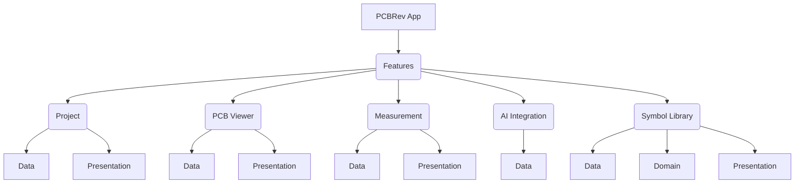

# PCBRev: Asystent Inżynierii Odwrotnej PCB

## 1. Założenia Projektu

PCBRev to aplikacja Flutter, której celem jest wspieranie inżynierii odwrotnej urządzeń elektronicznych. Umożliwia ona użytkownikom tworzenie schematów urządzeń na podstawie pomiarów fizycznych i analizy wizualnej płytek PCB, z wykorzystaniem wsparcia sztucznej inteligencji.

### 1.1. Podstawowa Funkcjonalność

Aplikacja ma za zadanie ułatwić proces rekonstrukcji schematu urządzenia elektronicznego poprzez:
- **Pomiary komponentów i połączeń:** Rejestrowanie wartości komponentów (np. rezystancji, pojemności) oraz śledzenie połączeń między nimi za pomocą omomierza lub innych narzędzi pomiarowych.
- **Analiza wizualna PCB:** Przetwarzanie zdjęć płytek PCB (zarówno strony komponentów, jak i strony połączeń) w celu dopasowania ich i wnioskowania o połączeniach między komponentami/wyprowadzeniami. Kluczowym elementem jest możliwość odwrócenia poziomego strony połączeń (dolnej) i nałożenia jej na stronę komponentów (górnej), co pozwala na wizualizację połączeń między warstwami płytki.
- **Wsparcie AI:** Wykorzystanie sztucznej inteligencji (za pośrednictwem `mcp-server`) do interpretacji połączeń, identyfikacji komponentów i analizy architektury urządzenia. AI otrzymuje bazę danych z aktualnymi danymi urządzenia, jego połączeniami, architekturą i obrazami, a następnie aktualizuje tę bazę.

### 1.2. Platforma Docelowa

Aplikacja jest rozwijana w technologii Flutter, co umożliwia jej działanie na wielu platformach, w tym na **Androidzie**, co jest głównym celem projektu. Architektura została zaprojektowana z myślą o skalowalności i łatwej adaptacji do różnych środowisk.

### 1.3. Kluczowe Funkcje

- **Zarządzanie obrazami PCB:** Wczytywanie i wyświetlanie zdjęć PCB (strona komponentów, strona połączeń).
- **Narzędzia do edycji obrazu:** Obracanie, odwracanie (poziome/pionowe - kluczowe dla nałożenia strony połączeń na stronę komponentów), regulacja kontrastu, jasności i inwersja kolorów dla lepszej analizy wizualnej.
- **Rejestrowanie pomiarów:** Moduł do wprowadzania i zarządzania pomiarami rezystancji, napięcia i ciągłości.
- **Modelowanie schematu:** Tworzenie i aktualizowanie cyfrowego modelu PCB, zawierającego komponenty, piny i połączenia (netlistę), w oparciu o struktury danych KiCad.
- **Integracja z AI (MCP Server):** Dwukierunkowa komunikacja z zewnętrznym serwerem AI, wysyłając dane PCB i obrazy do analizy oraz odbierając wyniki.
- **Zapis/Odczyt Projektu:** Możliwość zapisywania i wczytywania stanu projektu (w tym obrazów i ich modyfikacji) do/z pliku.

## 2. Integracja z AI (MCP Server)

Aplikacja PCBRev komunikuje się z zewnętrznymi modelami AI za pośrednictwem wbudowanego serwera **MCP (Machine-Controller-Protocol) Server**. Serwer ten działa jako most, udostępniając stan projektu i narzędzia, które model AI może wykorzystać do analizy i modyfikacji schematu.

### 2.1. Połączenie z Serwerem

- **Endpoint:** `http://localhost:8080/mcp` (konfigurowalny)
- **Metoda HTTP:** `POST`
- **Protokół:** `JSON-RPC 2.0`

Każde zapytanie do serwera musi być poprawnym żądaniem JSON-RPC 2.0 wysłanym metodą POST na podany endpoint.

### 2.2. Protokół Komunikacji

Komunikacja opiera się na standardzie JSON-RPC.

**Przykładowe zapytanie (Request):**
```json
{
  "jsonrpc": "2.0",
  "method": "tools/call",
  "id": "request-123",
  "params": {
    "name": "tool_name_to_call",
    "arguments": {
      "arg1": "value1",
      "arg2": "value2"
    }
  }
}
```

**Przykładowa odpowiedź (Response):**
```json
{
  "jsonrpc": "2.0",
  "id": "request-123",
  "result": {
    "content": [
      {
        "type": "text",
        "text": "{\"status\":\"success\",\"data\":{...}}"
      }
    ]
  }
}
```

**Test:**
```bash
curl -X POST -H "Content-Type: application/json" -d '{"jsonrpc": "2.0", "method": "tools/list", "id": 1, "params": {}}' http://localhost:8080/mcp 
```

### 2.3. Dostępne Narzędzia (Tools)

Model AI może interaktywnie korzystać z narzędzi udostępnianych przez serwer. Lista narzędzi jest dynamiczna i można ją uzyskać za pomocą metody `tools/list`. Główne dostępne narzędzia to:

- **`read_current_image`**: Odczytuje dane pikseli aktualnie wyświetlanego obrazu PCB i zwraca je (zazwyczaj w formacie Base64). Model AI powinien używać tych danych do przeprowadzenia analizy wizualnej.
- **`write_current_image_components`**: Zapisuje w projekcie wyniki rozpoznawania komponentów dla bieżącego obrazu. AI wywołuje to narzędzie po przetworzeniu danych obrazu uzyskanych za pomocą `read_current_image`.
- **`get_kicad_schematic`**: Pobiera pełne dane bieżącego schematu KiCad, w tym wszystkie instancje symboli, przewody i połączenia.
- **`get_symbol_libraries`**: Pobiera listę dostępnych bibliotek symboli KiCad. Pozwala to AI na dobranie odpowiedniego symbolu graficznego dla rozpoznanego komponentu.
- **`update_kicad_schematic`**: Stosuje zmiany na schemacie, takie jak dodawanie nowych symboli (komponentów) lub rysowanie nowych połączeń.

### 2.4. Przykładowy Scenariusz Użycia

1.  **Pobranie obrazu do analizy:** AI chce przeanalizować bieżący widok PCB. Wywołuje narzędzie `read_current_image`.
    ```json
    {
      "jsonrpc": "2.0",
      "method": "tools/call",
      "id": 2,
      "params": {
        "name": "read_current_image",
        "arguments": {}
      }
    }
    ```
    Serwer zwraca dane obrazu w formacie Base64.

2.  **Analiza po stronie AI i odesłanie wyników:** Model AI przetwarza otrzymane dane obrazu, rozpoznając na nim komponenty. Następnie odsyła wyniki do serwera za pomocą `write_current_image_components`.
    ```json
    {
      "jsonrpc": "2.0",
      "method": "tools/call",
      "id": 3,
      "params": {
        "name": "write_current_image_components",
        "arguments": {
          "components": [
            { "designator": "R1", "bounding_box": {"x": 50, "y": 100, "w": 40, "h": 15} },
            { "designator": "U2", "bounding_box": {"x": 150, "y": 200, "w": 80, "h": 60} }
          ]
        }
      }
    }
    ```

3.  **Weryfikacja w bibliotece symboli:** AI chce znaleźć symbole dla `R1` i `U2`. Wywołuje `get_symbol_libraries`, aby sprawdzić, czy w bibliotece `device` istnieją odpowiednie definicje.
    ```json
    {
      "jsonrpc": "2.0",
      "method": "tools/call",
      "id": 4,
      "params": { "name": "get_symbol_libraries", "arguments": {} }
    }
    ```

4.  **Aktualizacja schematu:** Po znalezieniu symboli, AI proponuje dodanie ich do schematu w określonych pozycjach.
    ```json
    {
      "jsonrpc": "2.0",
      "method": "tools/call",
      "id": 5,
      "params": {
        "name": "update_kicad_schematic",
        "arguments": {
          "updates": [
            {
              "action": "add_symbol",
              "payload": { "libId": "device:R", "ref": "R1", "at": {"x": 100, "y": 150} }
            },
            {
              "action": "add_symbol",
              "payload": { "libId": "device:LM358", "ref": "U2", "at": {"x": 200, "y": 150} }
            }
          ]
        }
      }
    }
    ```

## 3. Architektura Aplikacji

### 3.1. Przegląd

Architektura PCBRev opiera się na podejściu modułowym, zorientowanym na funkcje. Głównym założeniem jest **minimalistyczne i funkcyjne podejście** zamiast rozbudowanego programowania obiektowego. Logika biznesowa jest implementowana jako zbiory czystych funkcji, a modele danych są niezmiennymi strukturami (rekordami). Takie podejście upraszcza kod, zwiększa jego przewidywalność i ułatwia testowanie. Więcej szczegółów na temat przyjętych konwencji znajduje się w dokumencie `GEMINI.md`.

- **Core (`lib/core/`)**: Zawiera współdzielony kod, narzędzia i podstawowe klasy używane w całej aplikacji.
- **Features (`lib/features/`)**: Główny katalog zawierający moduły funkcjonalne. Każdy moduł jest samodzielną jednostką z własną architekturą wewnętrzną (dane, domena, prezentacja).

### 3.2. Struktura Modułów Funkcjonalnych

Każdy moduł w katalogu `lib/features/` jest zorganizowany według następującego schematu:

- **Data**: Warstwa danych, odpowiedzialna za źródła danych i modele (zdefiniowane jako rekordy).
- **Domain**: Warstwa domeny, zawierająca złożoną logikę biznesową. Ta warstwa jest **opcjonalna** i występuje tylko w bardziej skomplikowanych modułach, takich jak `symbol_library`.
- **Presentation**: Warstwa prezentacji, odpowiedzialna za interfejs użytkownika (widgety, strony) i zarządzanie stanem.

### 3.3. Diagram Architektury



## 4. Koncepcja Pracy i Model Danych (Workflow)

Aplikacja PCBRev jest zaprojektowana wokół interaktywnego procesu tworzenia schematu, inspirowanego standardami oprogramowania CAD, takiego jak KiCad.

### 4.1. Interfejs Użytkownika

Główny interfejs aplikacji jest podzielony na trzy panele:
- **Panel Lewy (Listy Globalne):** Zawiera listę wszystkich zidentyfikowanych komponentów oraz sieci (połączeń) w projekcie.
- **Panel Centralny (Widok Roboczy):** Główny obszar roboczy, który może działać w trybie **Widoku Obrazu** (analiza zdjęć PCB) lub **Widoku Schematu** (edycja schematu).
- **Panel Prawy (Właściwości i Pomiary):** Służy do wyświetlania szczegółów zaznaczonego elementu oraz do zarządzania pomiarami.

### 4.2. Proces Tworzenia Schematu

Proces rekonstrukcji schematu jest iteracyjny:
1.  **Dodawanie Obrazów:** Użytkownik ładuje zdjęcia płytki PCB.
2.  **Identyfikacja Komponentów:** Użytkownik dodaje komponenty do globalnej listy.
3.  **Tworzenie Schematu:** W widoku schematu, użytkownik umieszcza symbole komponentów z globalnej listy.
4.  **Definiowanie Połączeń (Netów):** Użytkownik rysuje połączenia (linie - *wires*) między pinami, co aktualizuje logiczną netlistę projektu.

### 4.3. Model Danych Inspirowany KiCad

Architektura danych ściśle oddziela **model logiczny** od jego **reprezentacji wizualnej**, implementując je jako **niezmienne rekordy (records)**.

Do reprezentacji schematu, komponentów (jako referencji do symboli) oraz połączeń (przewodów), aplikacja wykorzystuje **bezpośrednio struktury danych zdefiniowane w module `symbol_library`**. Moduł ten jest odpowiedzialny za parsowanie i zarządzanie formatem KiCad, co oznacza, że model danych aplikacji jest nie tylko inspirowany, ale w dużej mierze tożsamy ze strukturą schematu KiCad.

-   **Model Logiczny (Globalny):**
    -   **Net (Sieć):** Reprezentuje logiczne połączenie między co najmniej dwoma punktami (pinami komponentów). Jest to abstrakcyjny zbiór węzłów, podobnie jak w netliście KiCad. Przykładowo, sieć `VCC` łączy wszystkie piny, które mają być podłączone do zasilania.
        ```
        (net (code 1) (name "VCC")
          (node (ref V1) (pin 1))
          (node (ref R1) (pin 1))
          (node (ref U1) (pin 1)))
        ```
    -   **Component (Komponent):** Globalna definicja komponentu, zawierająca jego ID, typ, wartość i listę pinów.

-   **Reprezentacja Wizualna (Lokalna dla Widoku):**
    -   Każdy widok (czy to schemat, czy obraz PCB) posiada własną listę elementów wizualnych, które odnoszą się do modelu logicznego. Oznacza to, że **każdy obraz ma własną listę komponentów** (będących referencjami do listy globalnej), gdzie każdy komponent ma określone, lokalne współrzędne dla swoich punktów połączeń (pinów). Podobnie, **każdy obraz posiada własną listę wizualnych reprezentacji sieci**, które odnoszą się do globalnej netlisty, ale posiadają niezależne współrzędne dla węzłów i przewodów, tworząc jedynie wizualny kształt połączenia na danym obrazie.
    -   **Symbol:** Wizualna reprezentacja komponentu na schemacie, posiadająca współrzędne (`at`), referencję (`ref`) i inne atrybuty graficzne.
    -   **Wire (Przewód):** Linia graficzna łącząca punkty na schemacie. Posiada współrzędne (`pts`) definiujące jej kształt.
    -   **Junction (Węzeł):** Punkt graficzny wskazujący na połączenie kilku przewodów.
        ```
        (symbol (lib_id "Power:VCC") (at 100 50 0) (ref "V1") ...)
        (wire (pts (xy 100 50) (xy 120 50)))
        (junction (at 120 50))
        ```
    - Taki podział pozwala na elastyczność: ta sama logiczna sieć `VCC` może być inaczej narysowana na schemacie, a inaczej reprezentowana jako adnotacja na zdjęciu PCB. Użytkownik może dodawać komponenty i sieci z globalnej listy do dowolnego widoku, a ich pozycja i wygląd będą zapisane lokalnie dla tego widoku, nie wpływając na inne.

### 4.4. Zarządzanie Symbolami KiCad

Kluczowym elementem aplikacji jest zdolność do pracy z formatem KiCad. Aby to osiągnąć, moduł `symbol_library` precyzyjnie rozróżnia dwa fundamentalne pojęcia: **symbol biblioteczny** (definicję) i **instancję symbolu** (użycie na schemacie).

-   **Symbol Biblioteczny (`Library Symbol`):** Jest to abstrakcyjna definicja komponentu przechowywana w pliku biblioteki (`.kicad_sym`). Definiuje ona wygląd graficzny symbolu (kształty, tekst) oraz jego piny (numer, nazwa, pozycja, typ elektryczny). Jest to wzorzec, który nie posiada unikalnego identyfikatora (np. `R1`) ani pozycji na schemacie.

-   **Instancja Symbolu (`Symbol Instance`):** Jest to konkretne użycie symbolu bibliotecznego na schemacie (w pliku `.kicad_sch`). Każda instancja posiada:
    -   Odwołanie do **symbolu bibliotecznego** (`lib_id`), z którego czerpie swój wygląd.
    -   Unikalny identyfikator referencyjny (np. `R1`, `C1`, `U1`).
    -   Współrzędne (`at`) określające jej pozycję na schemacie.
    -   Właściwości (np. wartość `10kΩ`, napięcie `5V`), które mogą nadpisać domyślne wartości z definicji bibliotecznej.

Moduł `symbol_library` zarządza całym procesem przetwarzania tych danych, od wczytania plików aż po renderowanie:

1.  **Tokenizacja (`kicad_tokenizer.dart`):** Plik wejściowy (`.kicad_sym` lub `.kicad_sch`) jest dzielony na listę podstawowych tokenów (nawiasy, stringi, liczby).
2.  **Parsowanie S-wyrażeń (`kicad_sexpr_parser.dart`):** Strumień tokenów jest przekształcany w drzewo S-wyrażeń (S-Expressions), które jest podstawową strukturą danych w plikach KiCad.
3.  **Parsowanie Logiczne (`kicad_symbol_parser.dart`, `kicad_schematic_parser.dart`):** Drzewo S-wyrażeń jest analizowane, a jego zawartość jest mapowana na dedykowane, niezmienne rekordy:
    -   Z plików `.kicad_sym` powstają modele **symboli bibliotecznych**.
    -   Z plików `.kicad_sch` powstają modele **instancji symboli** oraz inne elementy schematu (przewody, nety).
4.  **Renderowanie (`kicad_symbol_renderer.dart`, `kicad_schematic_renderer.dart`):** Na podstawie modeli danych, wyspecjalizowane renderery (oparte na `CustomPainter`) rysują na ekranie:
    -   Pojedyncze **symbole biblioteczne** (np. w przeglądarce bibliotek).
    -   Cały schemat, rysując każdą **instancję symbolu** w jej odpowiednim miejscu i z jej właściwościami.

Dzięki takiemu podejściu, aplikacja może nie tylko wyświetlać istniejące schematy KiCad, ale również wykorzystywać te same struktury do tworzenia nowych schematów od zera, zachowując spójność z logiką oprogramowania CAD.

## 5. Szczegóły Implementacji (Aktualny Stan)

Projekt jest w fazie aktywnego rozwoju, a poniżej przedstawiono kluczowe aspekty obecnej implementacji.


### 5.1. Struktura Projektu

```
pcb_rev/
├── lib/
│   ├── features/
│   │   ├── ai_integration/
│   │   │   ├── data/
│   │   │   │   ├── core.dart
│   │   │   │   └── mcp_server.dart
│   │   │   ├── domain/
│   │   │   │   └── mcp_server_tools.dart
│   │   │   └── service/
│   │   │       └── http_client.dart
│   │   ├── global_list/
│   │   │   └── presentation/
│   │   │       └── widgets/
│   │   ├── measurement/
│   │   │   ├── data/
│   │   │   │   └── measurement_service.dart
│   │   │   └── presentation/
│   │   │       └── properties_panel.dart
│   │   ├── pcb_viewer/
│   │   │   ├── data/
│   │   │   │   ├── image_modification.dart
│   │   │   │   └── image_processor.dart
│   │   │   └── presentation/
│   │   │       └── pcb_viewer_panel.dart
│   │   ├── project/
│   │   │   ├── data/
│   │   │   │   └── project.dart
│   │   │   └── presentation/
│   │   │       └── main_screen.dart
│   │   ├── schematic/
│   │   │   ├── data/
│   │   │   │   ├── logical_models.dart
│   │   │   │   └── visual_models.dart
│   │   │   └── presentation/
│   │   │       └── widgets/
│   │   │           └── component_painters.dart
│   │   └── symbol_library/
│   │       ├── data/
│   │       │   ├── kicad_schematic_loader.dart
│   │       │   ├── kicad_schematic_models.dart
│   │       │   ├── kicad_symbol_loader.dart
│   │       │   └── kicad_symbol_models.dart
│   │       ├── domain/
│   │       │   ├── kicad_schematic_parser.dart
│   │       │   ├── kicad_schematic_writer.dart
│   │       │   ├── kicad_sexpr_parser.dart
│   │       │   ├── kicad_symbol_parser.dart
│   │       │   └── kicad_tokenizer.dart
│   │       └── presentation/
│   │           ├── kicad_schematic_renderer.dart
│   │           ├── kicad_symbol_renderer.dart
│   │           └── schematic_view.dart
│   └── main.dart
├── pubspec.yaml
├── README.md
... (pozostałe pliki projektu Flutter)
```
### 5.2. Interfejs Użytkownika (UI)

Interfejs użytkownika jest zbudowany z reużywalnych widżetów:

- **`main_screen.dart`**: Główny ekran aplikacji.
- **`global_list_panel.dart`**: Panel z listami komponentów i sieci.
- **`pcb_viewer_panel.dart`**: Panel do wyświetlania obrazów PCB.
- **`properties_panel.dart`**: Panel właściwości i pomiarów.
- **`schematic_view.dart`**: Główny widget widoku schematu.
- **`kicad_schematic_renderer.dart`**: Renderer odpowiedzialny za rysowanie całego schematu KiCad.
- **`kicad_symbol_renderer.dart`**: Renderer do rysowania pojedynczych symboli.
- **`component_painters.dart`**: Zestaw pomocniczych funkcji do rysowania prostych kształtów graficznych symboli.

### 5.3. Zależności

Projekt wykorzystuje następujące kluczowe zależności (zdefiniowane w `pubspec.yaml`):
- `flutter`: Podstawowy framework UI.
- `http`: Do komunikacji HTTP (np. z MCP Server).
- `image`: Biblioteka do przetwarzania obrazów.
- `desktop_drop`: Do obsługi przeciągania i upuszczania plików.
- `file_picker`: Do wyboru i zapisu plików.

## 6. Jak Uruchomić

Aby uruchomić aplikację, wykonaj następujące polecenia w katalogu głównym projektu:

```bash
flutter run -d linux # lub inne dostępne urządzenie, np. chrome, windows, macos
```

## 7. Dalszy Rozwój

- **Rozbudowa analizy AI:** Implementacja rzeczywistej logiki analizy w `mcp_server` i integracja z modelem AI do inkrementalnej budowy schematu na podstawie analizy połączeń między komponentami.
- **Wyrównywanie i nałożenie obrazów:** Rozwinięcie funkcji `alignImages` w `ImageProcessor` do precyzyjnego dopasowywania obrazów, w tym odwrócenia poziomego strony połączeń (dolnej) i nałożenia jej na stronę komponentów (górnej) w celu wizualizacji połączeń między warstwami płytki.
- **Interaktywne adnotacje:** Umożliwienie użytkownikowi dodawania, edytowania i usuwania adnotacji bezpośrednio na obrazie PCB.
- **Generowanie netlisty:** Rozbudowa funkcji eksportu do standardowych formatów netlist (np. SPICE, KiCad).
- **Walidacja schematu:** Implementacja narzędzi do automatycznej weryfikacji poprawności rekonstruowanego schematu.
- **Wsparcie dla wielu warstw PCB:** Rozszerzenie modelu danych i UI o obsługę wielowarstwowych płytek.