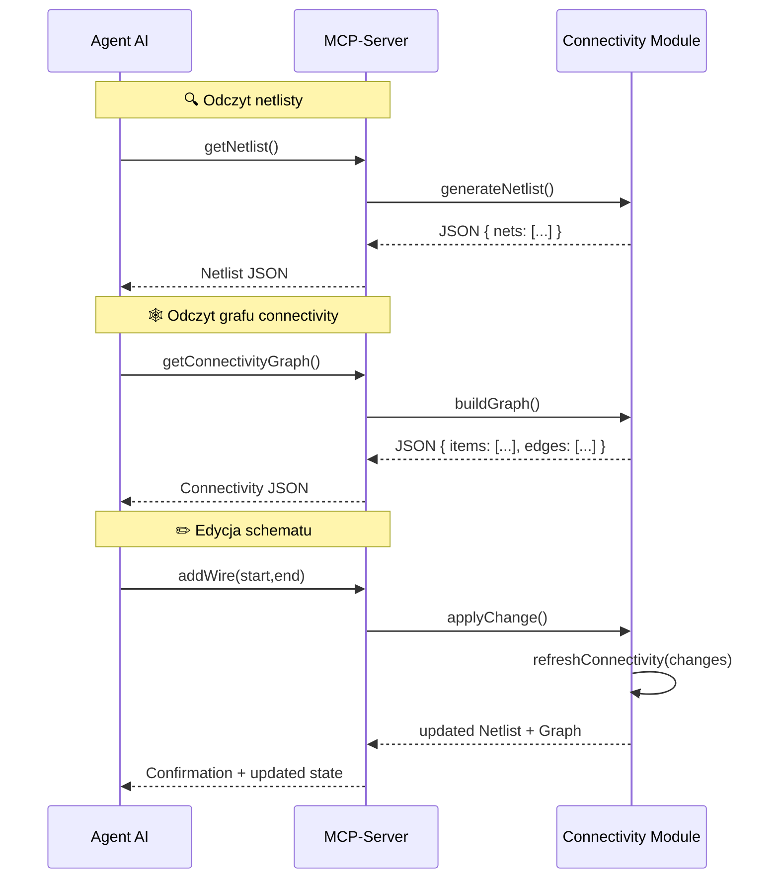

# Moduł *Connectivity*

Dokument opisuje projekt i implementację modułu **connectivity** w środowisku **Flutter/Dart**.

* opis architektury modułu,
* struktury danych w Dart,
* JSON dla **netlisty**,
* JSON dla **grafu connectivity**,
* oraz **diagram sekwencji** pokazujący jak to działa w runtime.

Moduł odpowiada za analizę schematu wczytanego z plików **KiCad Schematic (.kicad\_sch)** i wyznaczanie aktualnej netlisty.
Dane i funkcje modułu udostępniane są przez **mcp-server** jako narzędzia do analizy i edycji schematu.

---

## Architektura

Moduł jest podzielony na katalogi zgodnie z zasadami programowania funkcyjnego i separacji domen:

```
connectivity/
├─ models/
│  ├─ core.dart            // definicje głównych struktur danych
│  ├─ items.dart           // definicje CONNECTION_ITEM (wire, junction, pin, label)
│  └─ netlist.dart         // definicje NET, PIN_REF itd.
├─ graph/
│  ├─ build_graph.dart     // funkcje budujące CONNECTION_GRAPH z listy elementów
│  └─ resolve_connectivity.dart // flood-fill traversal, union-find
├─ api/
│  ├─ netlist_api.dart     // funkcje udostępniane dla mcp-server
│  └─ edit_api.dart        // funkcje edycyjne (dodawanie wire, junction itd.)
└─ utils/
   └─ geometry.dart        // funkcje do obliczeń geometrycznych
```

---

## Główne struktury danych (`models/core.dart`)

### `ConnectivityGraph`

Reprezentuje całość połączeń w schemacie (1 arkusz, bez hierarchii).

```dart
class ConnectivityGraph {
  final Map<String, ConnectionItem> items;       // wszystkie elementy po ID
  final List<ConnectionSubgraph> subgraphs;      // lista spójnych komponentów
  final Map<String, Net> nets;                   // nazwa netu → Net

  final DateTime lastUpdated;                    // znacznik odświeżenia

  ConnectivityGraph({
    required this.items,
    required this.subgraphs,
    required this.nets,
    required this.lastUpdated,
  });
}
```

### `ConnectionItem`

Abstrakcja wspólna dla wszystkich elementów schematu.

```dart
sealed class ConnectionItem {
  final String id;
  final Point position;           // współrzędne w schemacie
  final List<String> neighbors;   // ID sąsiadów

  ConnectionItem(this.id, this.position, this.neighbors);
}

class Wire extends ConnectionItem {
  final Point end; // start=position, end=end
  Wire(super.id, super.position, this.end, super.neighbors);
}

class Junction extends ConnectionItem {
  Junction(super.id, super.position, super.neighbors);
}

class Pin extends ConnectionItem {
  final String symbolRef;
  final String pinName;
  Pin(super.id, super.position, this.symbolRef, this.pinName, super.neighbors);
}

class Label extends ConnectionItem {
  final String netName;
  Label(super.id, super.position, this.netName, super.neighbors);
}
```

### `ConnectionSubgraph`

Spójny komponent w grafie connectivity.

```dart
class ConnectionSubgraph {
  final Set<String> itemIds;
  final String? resolvedNetName;   // po propagacji nazw

  ConnectionSubgraph({
    required this.itemIds,
    this.resolvedNetName,
  });
}
```

### `Net`

Opisuje pojedynczy net w netliście.

```dart
class Net {
  final String name;
  final List<PinRef> pins;

  Net(this.name, this.pins);
}

class PinRef {
  final String symbolRef;
  final String pinName;

  PinRef(this.symbolRef, this.pinName);
}
```

---

## Proces inicjalizacji

1. **Wczytanie schematu** (plik `.kicad_sch`) → parser dostarcza listę elementów (`Wire`, `Junction`, `Pin`, `Label`).
2. **Budowa grafu** (`buildGraph()`):

   * tworzony jest `ConnectivityGraph.items`
   * obliczane są sąsiedztwa na podstawie reguł geometrycznych
3. **Rozwiązywanie połączeń** (`resolveConnectivity()`):

   * algorytm flood-fill / union-find grupuje itemy w `ConnectionSubgraph`
   * propagacja nazw netów z etykiet i pinów specjalnych
4. **Generowanie netlisty** (`generateNetlist()`):

   * każdemu subgraph przypisywany jest `Net`
   * zbierane są wszystkie `PinRef`

---

## Odświeżanie Netlist

Moduł wspiera **inkrementalne odświeżanie**:

* Po każdej edycji (dodanie/usunięcie itemu) aktualizowane są tylko zmienione fragmenty grafu.
* Funkcja `refreshConnectivity(changes)`:

  * aktualizuje `items`
  * ponownie oblicza subgraphy w danym regionie
  * uaktualnia mapę `nets`
* `lastUpdated` jest odświeżany przy każdym przebudowaniu.

---

## API dla MCP-Server (`api/netlist_api.dart`)

### Funkcje odczytu

* `getNetlist(): List<Net>` – zwraca aktualną netlistę
* `getConnectivityGraph(): ConnectivityGraph` – pełny graf (do analizy AI)
* `getSubgraphByItemId(String id): ConnectionSubgraph?` – zwraca net danej instancji

### Funkcje edycji (`api/edit_api.dart`)

* `addWire(Point start, Point end)`
* `addJunction(Point position)`
* `addSymbol(String libraryId, Point position)`
* `addLabel(Point position, String netName)`
* `deleteItem(String id)`

### Funkcje walidacji

* `checkNetConflicts(): List<String>` – wykrywa konflikty nazw netów
* `runDRC(): List<String>` – prosta wersja Design Rule Check
* `validateAgainst(Netlist expected): DiffResult` – porównuje schemat z oczekiwaną netlistą

---

## Możliwość rozszerzeń

* **Hierarchia arkuszy**: dodanie `HierarchicalPort` i `Sheet` w `ConnectionItem`, oraz mechanizmu łączenia netów między arkuszami.
* **Obsługa magistral (bus)**: dodanie `Bus` i `BusEntry` w modelu.
* **Tryb inkrementalny**: cache spatial partitioning (np. grid indexing) do szybkiego wyszukiwania przecięć.


---

## przykładowy **JSON zwracany przez `getNetlist()`**


Funkcja `getNetlist()` zwraca aktualną netlistę w postaci **serializowanego JSON**.
Format został zaprojektowany tak, aby był prosty do analizy przez agentów AI i kompatybilny z potencjalnym eksportem do formatu SPICE/PCB.

### Struktura

```json
{
  "nets": [
    {
      "name": "GND",
      "pins": [
        { "symbolRef": "U1", "pinName": "3" },
        { "symbolRef": "R1", "pinName": "2" }
      ]
    },
    {
      "name": "VCC",
      "pins": [
        { "symbolRef": "U1", "pinName": "1" },
        { "symbolRef": "C1", "pinName": "1" }
      ]
    },
    {
      "name": "Net-(U1-Pad2)",
      "pins": [
        { "symbolRef": "U1", "pinName": "2" },
        { "symbolRef": "R1", "pinName": "1" },
        { "symbolRef": "C1", "pinName": "2" }
      ]
    }
  ],
  "symbols": [
    {
      "ref": "U1",
      "libraryId": "Device:OpAmp",
      "pins": [
        { "name": "1", "type": "input", "position": { "x": 100, "y": 200 } },
        { "name": "2", "type": "input", "position": { "x": 100, "y": 220 } },
        { "name": "3", "type": "power", "position": { "x": 80, "y": 210 } }
      ],
      "position": { "x": 100, "y": 200 }
    },
    {
      "ref": "R1",
      "libraryId": "Device:R",
      "pins": [
        { "name": "1", "type": "passive", "position": { "x": 150, "y": 200 } },
        { "name": "2", "type": "passive", "position": { "x": 170, "y": 200 } }
      ],
      "position": { "x": 160, "y": 200 }
    },
    {
      "ref": "C1",
      "libraryId": "Device:C",
      "pins": [
        { "name": "1", "type": "passive", "position": { "x": 180, "y": 220 } },
        { "name": "2", "type": "passive", "position": { "x": 200, "y": 220 } }
      ],
      "position": { "x": 190, "y": 220 }
    }
  ]
}
```

### Zasady

* **`nets`**: lista netów.

  * `name`: nazwa netu (z etykiety, symbolu zasilania albo wygenerowana `Net-(...)`).
  * `pins`: lista referencji pinów (`symbolRef`, `pinName`).

* **`symbols`**: lista instancji symboli na schemacie.

  * `ref`: unikalna referencja symbolu (`U1`, `R1` itd.).
  * `libraryId`: identyfikator w bibliotece KiCad (`Device:R`).
  * `pins`: opis pinów (nazwa, typ, pozycja na schemacie).
  * `position`: ogólna pozycja symbolu na arkuszu.

---

⚡️ Dzięki temu formatowi agent AI:

* może analizować **połączenia netów** (z sekcji `nets`)
* ma pełen dostęp do **symboli i pinów** (z sekcji `symbols`)
* nie musi rozumieć geometrii przewodów i junctions – dostaje gotową, semantyczną netlistę


---

## Format JSON – `getConnectivityGraph()`

Funkcja `getConnectivityGraph()` zwraca **pełny graf połączeń** w postaci JSON.
Ten format pozwala AI wykonywać analizy geometryczne, np. sprawdzanie kolizji, rekonstruowanie netów, wykrywanie nieoczywistych zwarć.
To jest bardziej „surowy” widok niż netlista: zamiast semantycznych netów mamy **węzły i krawędzie** wynikające bezpośrednio z geometrii schematu.

### Struktura

```json
{
  "items": [
    {
      "id": "wire_1",
      "type": "wire",
      "start": { "x": 100, "y": 200 },
      "end": { "x": 150, "y": 200 },
      "neighbors": ["junction_1", "pin_U1_1"]
    },
    {
      "id": "junction_1",
      "type": "junction",
      "position": { "x": 150, "y": 200 },
      "neighbors": ["wire_1", "wire_2"]
    },
    {
      "id": "pin_U1_1",
      "type": "pin",
      "position": { "x": 100, "y": 200 },
      "symbolRef": "U1",
      "pinName": "1",
      "neighbors": ["wire_1"]
    },
    {
      "id": "label_VCC",
      "type": "label",
      "position": { "x": 200, "y": 200 },
      "netName": "VCC",
      "neighbors": ["wire_2"]
    }
  ],
  "edges": [
    { "from": "wire_1", "to": "junction_1" },
    { "from": "wire_1", "to": "pin_U1_1" },
    { "from": "wire_2", "to": "junction_1" },
    { "from": "wire_2", "to": "label_VCC" }
  ]
}
```

---

### Zasady reprezentacji

* **`items`** – każdy element schematu, który uczestniczy w connectivity:

  * `id`: unikalny identyfikator w grafie
  * `type`: `"wire" | "junction" | "pin" | "label"` (później możliwe `"port" | "bus_entry"`)
  * `position`: punkt `(x,y)` (dla junction, pin, label)
  * `start` + `end`: linia (dla wire)
  * `symbolRef`, `pinName`: dodatkowe pola dla pinów
  * `netName`: dodatkowe pole dla labeli

* **`neighbors`** – lista ID sąsiadów (dla szybkiego traversalu bez patrzenia w `edges`).

* **`edges`** – jawna lista krawędzi (opcjonalna, ale przydatna gdy AI chce pracować na czystym grafie).

---

### Relacja do Netlisty

* **Graf connectivity** to warstwa *geometryczna/topologiczna*.
* **Netlista** to warstwa *semantyczna* uzyskana przez flood-fill traversal + propagację nazw netów.

---

⚡️ Dzięki temu AI ma dwa poziomy pracy:

* **na netliście (`getNetlist()`)** → analiza logiczna połączeń (który pin do którego netu),
* **na grafie (`getConnectivityGraph()`)** → analiza geometryczna i strukturalna (które wires sąsiadują, gdzie są junctions, jak wygląda spójność).

---

# Przykładowy flow użycia `getConnectivityGraph()` i `getNetlist()`
Przykład pokazuje jak umożliwić agentowi AI połączenie logiczne obu widoków.
Moduł *connectivity* udostępnia dwie warstwy widoku schematu:

* **Graf connectivity (`getConnectivityGraph()`)** – surowa topologia (items + edges).
* **Netlista (`getNetlist()`)** – przetworzony widok semantyczny (nets + pins).

AI lub inne moduły mogą korzystać z obu w zależności od zadania.

---

## Typowy scenariusz pracy agenta AI

### 1. Odczyt grafu (niski poziom)

```json
{
  "items": [
    { "id": "wire_1", "type": "wire", "start": {"x": 100, "y": 200}, "end": {"x": 150, "y": 200}, "neighbors": ["pin_U1_1", "junction_1"] },
    { "id": "pin_U1_1", "type": "pin", "position": {"x": 100, "y": 200}, "symbolRef": "U1", "pinName": "1", "neighbors": ["wire_1"] }
  ],
  "edges": [
    { "from": "wire_1", "to": "pin_U1_1" }
  ]
}
```

Agent widzi:

* że `wire_1` kończy się na `pin_U1_1`
* że `wire_1` dalej łączy się przez `junction_1` z kolejnymi przewodami

Na tym etapie można np. wykrywać błędy rysunkowe (wire narysowany, ale niepołączony).

---

### 2. Odczyt netlisty (wysoki poziom)

```json
{
  "nets": [
    {
      "name": "VCC",
      "pins": [
        { "symbolRef": "U1", "pinName": "1" },
        { "symbolRef": "C1", "pinName": "1" }
      ]
    }
  ]
}
```

Agent widzi:

* że pin `U1.1` i pin `C1.1` należą do tego samego netu `VCC`
* ma już **nazwę netu** i pełny zestaw pinów, bez potrzeby analizowania geometrii

---

### 3. Połączenie obu widoków

* **Graf** → pozwala prześledzić ścieżkę geometryczną od `pin_U1_1` do `pin_C1_1` (np. przez wires i junctions).
* **Netlista** → daje semantyczny wynik: oba piny należą do `VCC`.

> **Przykład zastosowania**:
> AI może wykryć, że **wire** został narysowany, ale nie ma przypisanej etykiety i tworzy osobny net `Net-(U1-Pad1)` → wtedy agent może zasugerować dodanie labela `VCC`.

---

## Flow API – krok po kroku

1. **Po wczytaniu schematu** → `ConnectivityGraph` tworzony w pamięci.
2. **Agent pyta o netlistę** → `getNetlist()` → dostaje czystą strukturę logiczną.
3. **Agent pyta o graf** → `getConnectivityGraph()` → dostaje szczegóły geometryczne.
4. **Agent wykonuje analizę hybrydową**:

   * sprawdza, czy wszystkie piny z netlisty są faktycznie połączone w grafie,
   * sprawdza, czy przewody nie prowadzą donikąd,
   * wykrywa konflikty nazw (np. dwa różne label’e w tym samym subgraph).
5. **Agent dokonuje edycji** (np. dodaje wire, junction, label) → MCP API (`addWire`, `addLabel`).
6. **Moduł odświeża netlistę** (`refreshConnectivity()`) i API zwraca nowy stan.

---

## Zalety podejścia dwuwarstwowego

* **Netlista** = szybki dostęp do logiki połączeń (dla AI nieznającego geometrii).
* **Graf** = pełna kontrola nad strukturą schematu (dla AI robiącego np. *auto-routing* przewodów).
* **Spójność**: oba widoki synchronizowane są przez tę samą strukturę `ConnectivityGraph` w pamięci.

---

## Diagram sekwencji – Flow API

**Prosty sekwencyjny diagram pokazujący interakcję**: *AI → MCP server → Connectivity → Netlist/Graf*
Diagram pokazuje przepływ danych między agentem AI, serwerem MCP i modułem *connectivity* w dwóch przypadkach: odczytu i edycji. 



---

## Implementacja `getNetlist()` (na bazie klas z `core.dart`)

Plik: `lib/features/connectivity/api/netlist_api.dart`.
Zakładamy, że mamy już zaimplementowane struktury (`ConnectivityGraph`, `ConnectionSubgraph`, `Net`, `PinRef` itd.) w `lib/features/connectivity/models/core.dart`.
### Jak to działa?

1. Funkcja iteruje po wszystkich `ConnectionSubgraph` → traktuje każdy jako **jeden net**.
2. Rozwiązuje nazwę netu:

   * jeśli `resolvedNetName` jest dostępne → używa jej,
   * inaczej generuje automatyczną (`Net-xxx`).
3. Zbiera wszystkie piny (`Pin`) w tym subgraph.
4. Buduje obiekt JSON `{ nets, symbols }`.
5. Zwraca ładnie sformatowany JSON (przydatne do debugowania).

---

## Implementacja `getConnectivityGraph()` (Dart)

Plik: `lib/features/connectivity/api/netlist_api.dart`


### Jak to działa?

1. Iterujemy przez wszystkie `items` w `ConnectivityGraph`.
2. Każdy item serializujemy do JSON zależnie od typu (`Wire`, `Junction`, `Pin`, `Label`).
3. Dla każdego itemu dodajemy krawędzie (`edges`) do jego sąsiadów (`neighbors`).
4. Tworzymy końcowy JSON `{ items, edges }`.
5. Zwracamy jako string sformatowany `JsonEncoder.withIndent`.

---

### Przykład użycia

```dart
final graphJson = getConnectivityGraph(myConnectivityGraph);
print(graphJson);
```

Output (przykładowy):

```json
{
  "items": [
    {
      "id": "wire_1",
      "type": "wire",
      "start": {"x": 100, "y": 200},
      "end": {"x": 150, "y": 200},
      "neighbors": ["pin_U1_1", "junction_1"]
    },
    {
      "id": "junction_1",
      "type": "junction",
      "position": {"x": 150, "y": 200},
      "neighbors": ["wire_1", "wire_2"]
    }
  ],
  "edges": [
    {"from": "wire_1", "to": "pin_U1_1"},
    {"from": "wire_1", "to": "junction_1"},
    {"from": "junction_1", "to": "wire_1"},
    {"from": "junction_1", "to": "wire_2"}
  ]
}
```

---

## Implementacja `refreshConnectivity(changes)` (Dart)

Plik: `lib/features/connectivity/graph/refresh.dart`

Prosta implementacja `refreshConnectivity(changes)`, aktualizuje graf i netlistę po każdej edycji (np. `addWire`).
Założenie: chcemy, żeby po zmianach w schemacie (np. dodanie **wire**, **pin**, **junction**) moduł *connectivity* przebudował graf i netlistę **tylko dla zmienionych elementów**, a nie całego schematu.

## Jak to działa?

1. `refreshConnectivity()` przyjmuje:

   * stary graf `oldGraph`,
   * listę zmian (`changes`).

2. Iteruje po zmianach:

   * `AddWireChange` → dodaje nowy `Wire` i łączy go z sąsiadami (sprawdza geometrię).
   * `RemoveItemChange` → usuwa item i jego referencje z `neighbors`.

3. Po zastosowaniu zmian:

   * przebudowuje subgraphy (`buildSubgraphs(graph)`),
   * propaguje nazwy netów (`resolveNetNames(graph)`).

4. Zwraca nowy, zaktualizowany `ConnectivityGraph`.

---

## Przykład użycia

```dart
final changes = [
  AddWireChange(Wire(
    id: "wire_99",
    position: Point(100, 200),
    end: Point(150, 200),
  ))
];

final updatedGraph = refreshConnectivity(myGraph, changes);

print(getNetlist(updatedGraph));
print(getConnectivityGraph(updatedGraph));
```

---

👉 To jest wersja **inkrementalna** – idealna pod MCP, bo nie trzeba zawsze przebudowywać całego schematu.

